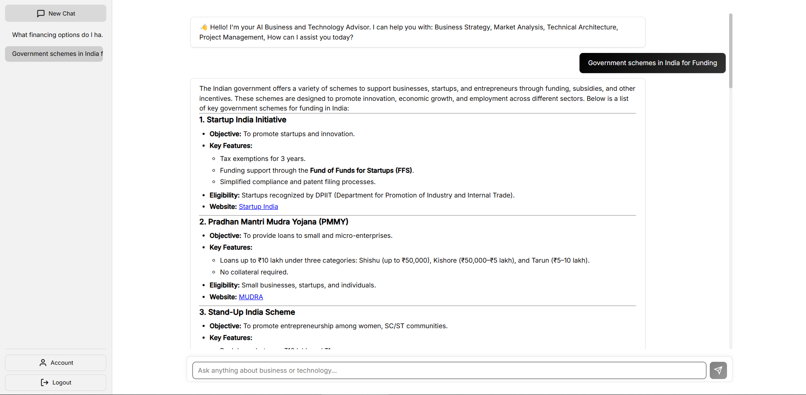

# BusinessTech Advisor AI

> An AI-powered business consultant using Deepseek Chat model, offering real-time expertise in strategy, tech, and management. Basically, this is a sophisticated AI-powered business and technology consulting platform that provides real-time advice on business strategy, market analysis, technical architecture, and project management.



## Overview

BusinessTech Advisor AI is a modern web application that combines advanced AI capabilities with an intuitive user interface to deliver professional consulting services. The application leverages the Deepseek Chat model (deepseek-chat) to provide expert guidance across various business and technical domains.

## Features

- **Real-time AI Consulting**
  - Business strategy development
  - Market research and analysis
  - Technical architecture design
  - Project management guidance

- **Modern User Interface**
  - Clean, minimalist design
  - Responsive layout
  - Intuitive chat interface
  - Dark/light theme support

- **Advanced Chat Capabilities**
  - Real-time message streaming
  - Code syntax highlighting
  - Markdown support
  - Message history management

- **Authentication System**
  - Email/password authentication
  - Social login integration
  - Secure session management
  - User profile management

## Technical Architecture

### Frontend
- **Framework**: React with Vite
- **Key Libraries**:
  - `react-markdown`: Markdown rendering
  - `react-syntax-highlighter`: Code highlighting
  - `react-router-dom`: Navigation
  - `@emotion/react` & `@emotion/styled`: Styling

### Backend
- **Framework**: Express.js
- **AI Model**: Deepseek Chat (deepseek-chat)
- **Key Features**:
  - RESTful API architecture
  - Server-sent events for real-time communication
  - Deepseek AI integration with streaming responses
  - CORS support

## Prerequisites

- Node.js (v14.0.0 or higher)
- npm or yarn
- Deepseek API key

## Installation

1. **Clone the Repository**
   ```bash
   git clone [repository-url]
   cd businesstech-advisor
   ```

2. **Backend Setup**
   ```bash
   cd backend
   npm install
   ```
   Create a `.env` file in the backend directory:
   ```env
   DEEPSEEK_API_KEY=your_api_key_here
   ```

3. **Frontend Setup**
   ```bash
   cd frontend
   npm install
   ```

## Configuration

### Backend Configuration
- Port: 3001 (configurable in `server.js`)
- Environment variables:
  - `DEEPSEEK_API_KEY`: Your Deepseek API key
  - `NODE_ENV`: Development/production environment

### Frontend Configuration
- Port: 5173 (default Vite port)
- API proxy configuration in `vite.config.js`
- Environment variables in `.env`:
  ```env
  VITE_API_URL=http://localhost:3001
  ```

## Running the Application

1. **Start the Backend Server**
   ```bash
   cd backend
   npm run dev
   ```
   The server will start on http://localhost:3001

2. **Start the Frontend Development Server**
   ```bash
   cd frontend
   npm run dev
   ```
   The application will be available at http://localhost:5173

## Project Structure

```
businesstech-advisor/
├── backend/
│   ├── server.js
│   ├── package.json
│   └── .env
├── frontend/
│   ├── src/
│   │   ├── components/
│   │   │   ├── Chat/
│   │   │   └── Auth/
│   │   ├── utils/
│   │   └── App.jsx
│   ├── package.json
│   └── vite.config.js
└── README.md
```

## API Endpoints

### Chat API
- `POST /api/chat`
  - Handles chat completions
  - Supports streaming responses
  - Requires authentication

### Authentication API
- `POST /auth/login`
- `POST /auth/signup`
- `POST /auth/logout`
- `GET /auth/profile`

## Security Considerations

- CORS configuration
- API key protection
- Rate limiting
- Input validation
- XSS protection
- CSRF protection

## Development Guidelines

1. **Code Style**
   - Follow ESLint configuration
   - Use Prettier for formatting
   - Follow component-based architecture

2. **Git Workflow**
   - Feature branches
   - Pull request reviews
   - Semantic versioning

3. **Testing**
   - Unit tests for components
   - API endpoint testing
   - Integration testing

## Production Deployment

1. **Backend Deployment**
   - Set production environment variables
   - Configure PM2 or similar process manager
   - Set up reverse proxy (Nginx/Apache)

2. **Frontend Deployment**
   - Build production assets
   ```bash
   cd frontend
   npm run build
   ```
   - Deploy to static hosting service

## Contributing

1. Fork the repository
2. Create a feature branch
3. Commit changes
4. Push to the branch
5. Create a pull request

## License

This project is licensed under the MIT License - see the LICENSE file for details.

## Support

For support, please open an issue in the repository or contact the development team.

## Acknowledgments

- Deepseek AI for providing the AI capabilities
- React and Vite communities
- Contributors and maintainers
